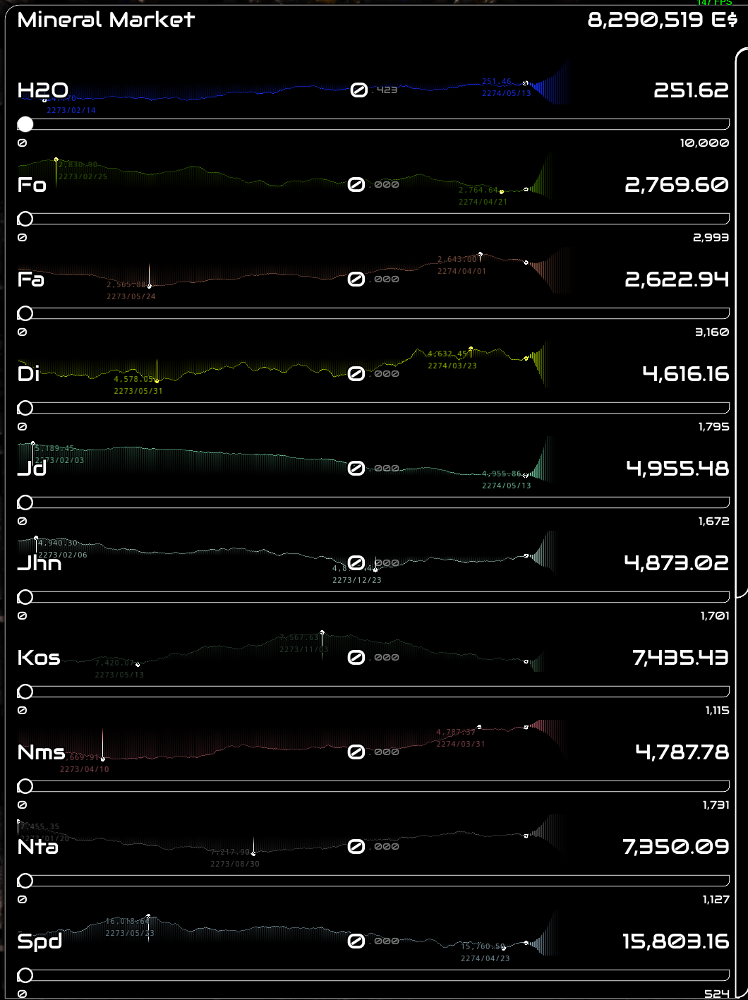
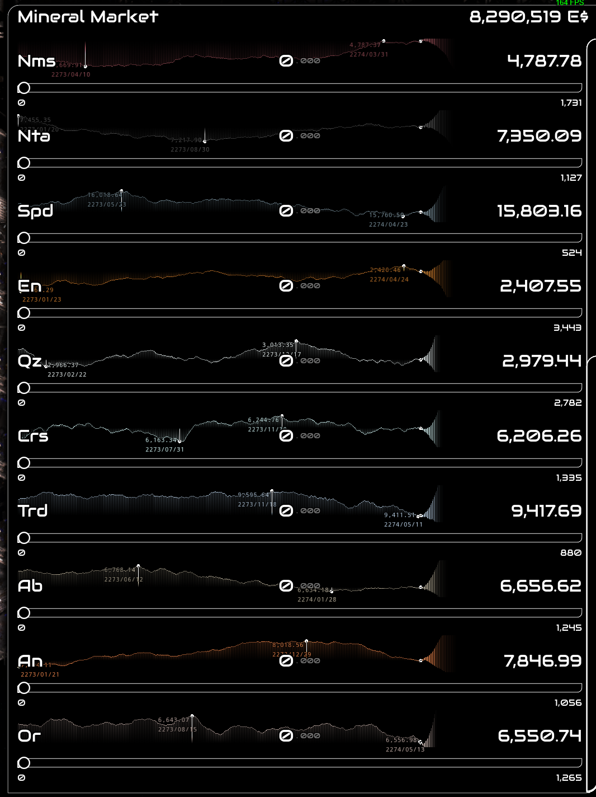
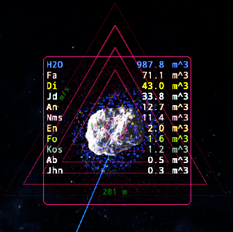
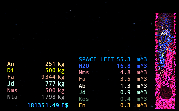
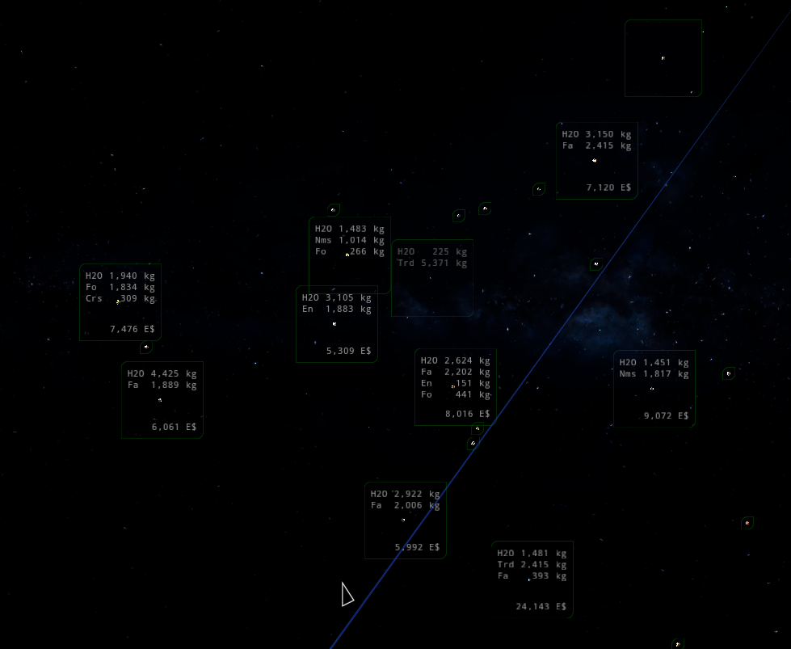

# Realistic Minerals

This mod adds 16 new minerals to the game, alongside new Obonto trades for each. 
This mod is based on an "educated guess" after a quick study (more like 8 hours) of Cassini's data on Saturn's rings, and the composition of the asteroid belts.

While some of the information was a bit vague, I tried to make the best of it by comparing the data to the minerals we have on Earth, and the prices of the minerals in the game.

Prices are based on how useful the minerals would be to a theoretical space faring civilization, how difficult it would be to extract them, how difficult it would be to process them, and how rare they are. There's definitely a lot of guess work involved, some decisions were arbitrary, but overall I tried to make it as realistic as possible.

Definitely was aided by ChatGPT to process the data and help me make decisions.

## Features:

- 16 new mineral types!
    - Forsterite or **Fo**, priced at: **$2.8k** per ton, 
    - Fayalite or **Fa**, priced at: **$2.6k** per ton, 
    - Diopside or **Di**, priced at: **$4.6k** per ton, 
    - Jadeite or **Jd**, priced at: **$5.1k** per ton, 
    - Johannsenite or **Jhn**, priced at: **$4.9k** per ton, 
    - Kosmochlor or **Kos**, priced at: **$7.3k** per ton, 
    - Namansilite or **Nms**, priced at **$4.8k** per ton, 
    - Natalyite or **Nta**, priced at **$7.4k** per ton, 
    - Spodumene or **Spd**, priced at **$15.8k** per ton, 
    - Enstatite or **En**, priced at **$2.4k** per ton, 
    - Quartz or **Qz**, priced at **$3.0k** per ton, 
    - Cristobalite or **Crs**, priced at **$6.2k** per ton, 
    - Tridymite or **Trd**, priced at **$9.5k** per ton, 
    - Albite or **Ab**, priced at **$6.7k** per ton, 
    - Anorthite or **An**, priced at **$7.9k** per ton, 
    - Orthoclase or **Or**, priced at **$6.6k** per ton, 

- Since MoreMinerals is a requirement, you can still tweak MoreMinerals' settings to your liking, and all features from it, except for the minerals added by it, will still work.

## Gallery

## Requirements

- dV v.1.52.28 or higher
- [MoreMinerals](https://github.com/ZakrinYoran/ZKYs-of-Saturn/tree/main/MoreMinerals)

## Installation:

To install, go to the game's installation directory (the directory containing `Delta-V.pck`), and create a new directory called `mods`. Place the mod `.zip` in this `mods` directory, this must be `RealisticMinerals.zip` and not an extracted folder.

To run the game with mods, run it with the `--enable-mods` command-line parameter. If using Steam, you can add the parameter in the game's properties → General → Launch Options.

## Acknowledgements

- @ZakrinYoran for all the guidance and help with the modding process.
- dV devs for making such an amazing game.
- The dV community for being so welcoming and helpful.

## Sources

- [Cassini Rings Science](https://pds-atmospheres.nmsu.edu/data_and_services/atmospheres_data/Cassini/sci-rings.html)
- [Cassini Final Report, Rings Discipline Working Group](https://pds-atmospheres.nmsu.edu/data_and_services/atmospheres_data/Cassini/logs/RWG_FinalReport-2.pdf)